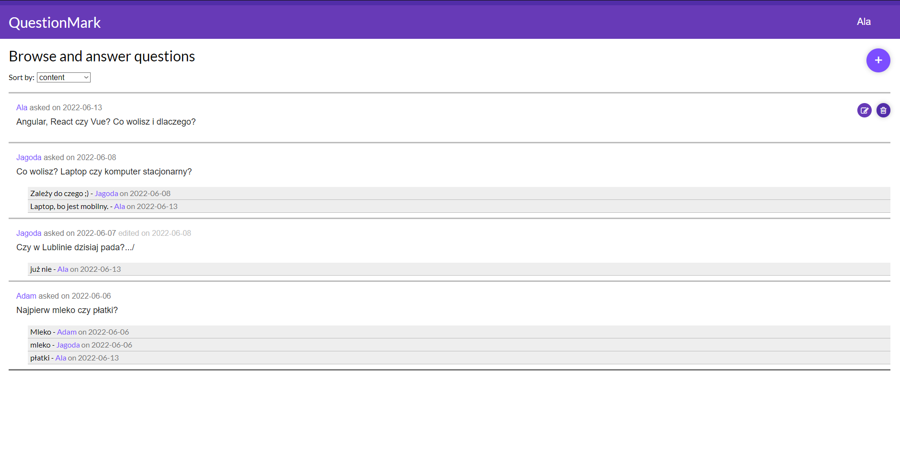

# QuestionMark
Project to pass the subject "Development frameworks in web applications.". Client-side application - React.js, Node.js, validation, RESTful API, CRUD, MVC. Server-side application - Express.js, Node.js, MongoDB, JSON Web Token, CRUD.

## General Information
- Acquiring the skills of programming web applications based on
web programming frameworks.
- Developing the habit of taking care of the high quality of created applications in relation to
to functionality, performance and security.

## Technologies Used
- React.js
- Express.js
- Node.js
- HTML5
- CSS
- MongoDB
- JSON Web Token
- Visual Studio Code
- MongoDB Compass
- Postman

## Features
- Quest can read questions and answers
- Quest can register and become a user for more posibilities
- User can login by email and password
- User can add questions and answers
- User can edit or delete added questions and answers
- User can change his/her name, email and password

## Screenshots

## Usage
1. You must first run the MongoDB server with the 'mongod' command in the C:\Program Files\MongoDB\Server\5.0\bin> folder
2. Open project folder in another terminal and go to server folder
3. Start server-side by command 'npm start'
4. Open project folder in another terminal and go to client folder
3. Client folder didn't have node_module folder so install it by command 'npm install'
4. Then start by command 'npm start'

## Acknowledgements
- This project was inspired by [Zapytaj.onet.pl](https://zapytaj.onet.pl).
- This project was based on [Zintegrowany Program Rozwoju Politechniki Lubelskiej](https://weii.pollub.pl/projekty-weii/projekt-zintegrowany-program-rozwoju-politechniki-lubelskiej-czesc-druga).